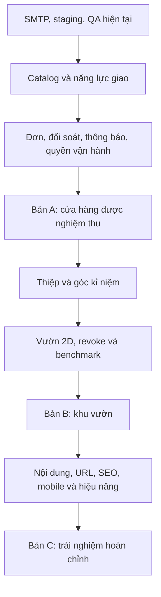

# Garden Dreams — kế hoạch big update

Ngày lập: 09/10/2026, giờ Việt Nam. Đây là phạm vi đề xuất để review, chưa triển khai các tính năng mới. Thứ tự ưu tiên chủ shop đã chọn: **vận hành và bán hoa thật → vườn kỉ niệm → hoàn thiện trải nghiệm toàn website**.

## 1. Đích đến

Garden Dreams trở thành một cửa hàng có thể vận hành đơn hoa từ lúc khách chọn quà đến khi giao và đối soát xong. Mỗi lần mua thành công giữ lại một kỉ niệm riêng; khách chủ động chia sẻ chính lời nhắn trên thiệp. Quản trị phải đủ rõ để chủ shop biết hôm nay cần bó gì, giao ở đâu, đơn nào đã nhận tiền và việc nào đang chờ xử lý.

Chia big update thành ba bản phát hành có thể dùng riêng:

| Bản                        | Kết quả                                                                                   | Điều kiện hoàn thành                                                                                    |
| -------------------------- | ----------------------------------------------------------------------------------------- | ------------------------------------------------------------------------------------------------------- |
| A — Cửa hàng vận hành được | Sản phẩm/biến thể, giao theo lịch, xử lý đơn, đối soát, thông báo và dữ liệu an toàn      | Luồng mua → xác nhận → bó hoa → giao → nhận tiền chạy qua trên môi trường thử; chủ shop nghiệm thu      |
| B — Khu vườn có bản sắc    | Góc kỉ niệm cá nhân, thiệp đẹp có link riêng, khu vườn khám phá được và quyền rút chia sẻ | Một đơn thành công sinh đúng một dấu; nội dung công khai tuân thủ lựa chọn của khách                    |
| C — Trải nghiệm hoàn chỉnh | Storefront trên mobile, trang sản phẩm có URL, nội dung chỉnh được, SEO và tốc độ         | Luồng đã có vẫn hoạt động; URL cũ còn mở được; đạt các mục tiêu hiệu năng và khả năng truy cập bên dưới |

Ưu tiên miễn phí lúc thử nghiệm. Việc phát sinh phí dịch vụ, mua domain hoặc chuyển hosting cần được chốt riêng trước khi thực hiện.

## 2. Điểm xuất phát đã kiểm tra

**Đã có mã và hạ tầng:** React/Vite, Supabase PostgreSQL/Auth/RLS/RPC, catalog 20 bó mẫu, giỏ hàng, COD/VietQR đối soát thủ công, admin sửa shop/hoa/ship, lịch sử và tiến trình đơn, kỉ niệm riêng/link/vườn, cursor, migration và audit. Frontend production đã deploy; API thật đọc được dữ liệu công khai và từ chối anon vào bảng riêng.

**Bằng chứng hiện có:** 19 tests và build qua; SDK tích hợp đã thử local; benchmark một triệu kỉ niệm giả dùng index, tải 24 dấu/trang. Riêng bảng kỉ niệm và index khoảng 497 MB với thông điệp ngắn, chưa gồm đơn hàng. Chủ shop đã xác nhận cấp admin và Cron retention `active=true`.

**Chưa nghiệm thu trực tiếp:** UI desktop/mobile, phiên admin thật, luồng đơn đầy đủ trên Supabase, email cho khách, QR qua ứng dụng ngân hàng, lịch sử chạy Cron và khôi phục backup. Cửa hàng vẫn đóng nhận đơn. Đây là việc cần hoàn tất trước khi mở bán.

**Khoảng trống sản phẩm:** chưa có biến thể/album ảnh, giới hạn năng lực giao theo lịch, quản lý yêu cầu thay đổi/hủy, sổ đối soát dễ tra cứu, dashboard vận hành, upload ảnh, thông báo đơn, trang sản phẩm/thiệp có metadata riêng. Phiên đăng nhập hiện giữ trong bộ nhớ tab; tải lại trang cần đăng nhập lại.

## 3. Những quy tắc tiếp tục giữ

- Một cửa hàng, tiền VNĐ, COD và VietQR. Admin chỉ xác nhận tiền sau đối soát thực tế. Trạng thái hoàn tiền ghi nhận giao dịch đã xử lý bên ngoài.
- Giá, phí, slot và quyền được kiểm tra phía máy chủ. Đơn cũ giữ snapshot sản phẩm, biến thể, phí và tài khoản nhận tiền; thay cấu hình không sửa lịch sử.
- Mỗi đơn đã giao và đã trả tạo đúng một kỉ niệm. Đơn thử không đi vào thống kê mua thật; fixture chỉ nằm trong môi trường thử. Retry và cập nhật trạng thái không sinh dấu trùng.
- Mặc định giữ riêng. Khách chọn link hoặc thêm vào vườn, không có bước admin duyệt trước. Nội dung chia sẻ là lời nhắn thực sự đã gửi; không tạo lời nhắn quảng bá thay khách.
- Public API chỉ trả phần khách cho phép. Không đưa mã đơn, tài khoản, địa chỉ, điện thoại, thanh toán hay dữ liệu giao hàng vào thiệp công khai.
- Rút chia sẻ làm lượt truy cập mới tới link cũ không còn xem được; công khai lại dùng token mới. Bản sao/ảnh đã được người khác lưu không thể tự thu hồi.
- Giữ backend độc lập Vercel; không đưa password database, service-role key hoặc token đăng nhập vào repo/bundle/log. Chưa thay quyết định giữ phiên trong bộ nhớ bằng lưu bearer token vào localStorage.

## 4. Lộ trình theo thứ tự đã chọn

### Giai đoạn 0 — Hoàn tất nền tảng và chứng minh luồng hiện tại

Đây là phần nối tiếp checklist còn mở, thực hiện trước khi thêm nghiệp vụ.

1. Tách môi trường thử khỏi production; dùng project Free thứ hai nếu tài khoản còn quota. Gắn cờ đơn thử để không tính doanh thu/kỉ niệm mua thật. Preview không được tự dùng database production.
2. Cấu hình SMTP và URL callback; kiểm thử đăng ký, xác nhận, đăng nhập, khôi phục, đăng xuất. Kiểm tra quyền khách/admin qua API và UI.
3. Kiểm thử hai khách, admin, COD và VietQR, retry, lỗi mạng, hủy/hoàn tiền, chia sẻ/rút chia sẻ. Quét QR kiểm tra ngân hàng/người nhận/tổng/mã; việc chuyển tiền thật do chủ shop thực hiện nếu cần.
4. Kiểm thử mobile, bàn phím, dialog, reduced motion, nội dung dài. Kiểm tra Cron và thực hành khôi phục backup vào database thử.
5. Chốt khu vực giao, chính sách, quyền sử dụng ảnh/video và hosting cho mục đích thương mại trước khi mở nhận đơn.

**Cổng nghiệm thu:** có biên bản từng luồng và kết quả thật; các lỗi nghiêm trọng về quyền, tiền, đặt trùng, lịch sử hoặc lộ dữ liệu phải được xử lý. Production tiếp tục đóng trong thời gian thử.

### Giai đoạn 1 — Đơn hàng, thanh toán và giao nhận đủ để vận hành

**Sản phẩm và cách đặt:** admin quản lý album ảnh, danh mục/dịp, biến thể cỡ bó và mức giá; trạng thái còn nhận đặt/tạm ngừng. Khách thấy lựa chọn và tổng tiền rõ trước khi gửi. Upload ảnh vào storage do shop kiểm soát, giới hạn dung lượng/loại file và tối ưu ảnh. Mô tả rõ hoa theo mùa và quy trình xin khách đồng ý khi thay hoa.

**Lịch giao:** admin đặt vùng, phí, ngày nghỉ, khung giờ, thời hạn đặt và số đơn có thể phục vụ. Đơn chờ xác nhận là yêu cầu; xác nhận mới giữ chỗ. Máy chủ giữ/nhả chỗ nguyên tử, kiểm tra phiên bản để hai admin không cùng bán vượt năng lực. Giai đoạn đầu khách chọn khu vực mô tả, admin kiểm tra địa chỉ; chưa cần API định vị hoặc định tuyến giao hàng.

**Bàn xử lý đơn:** có các hàng đợi hôm nay, chờ xác nhận, đang bó, đang giao, chờ đối soát và lỗi cần xử lý. Tìm theo mã đơn/ngày/trạng thái với phân trang máy chủ. Từ một đơn có thể xem snapshot, timeline, công việc kế tiếp và ghi chú nội bộ; ghi chú nội bộ tách khỏi thông báo khách.

**Thay đổi và hủy:** khách gửi yêu cầu có lý do và nhìn thấy kết quả xử lý. Admin chấp nhận/từ chối theo chính sách, có audit. Sửa lịch/người nhận/tổng tiền phải lưu đề xuất và sự đồng ý cần thiết; không âm thầm ghi đè snapshot hoặc đổi trạng thái đã trả. Bản A xử lý hoàn tiền toàn phần, chưa đưa hoàn tiền một phần vào luồng.

**Đối soát:** danh sách khoản cần thu, đã thu, đã ghi nhận hoàn; tham chiếu giao dịch/COD, thời điểm và người kiểm tra. Báo cáo tách giá trị yêu cầu, tiền đã nhận, tiền hoàn và số đơn giao thành công. “Khách báo đã chuyển” là thông tin chờ kiểm tra.

**Giao nhận và thông báo:** admin giao việc cho người phụ trách, cập nhật thất bại/giao lại bằng sự kiện riêng. Khách theo dõi trạng thái và nhận thông báo trong tài khoản; email đơn được gửi bởi backend với retry/idempotency, không phụ thuộc tab trình duyệt. Lời nhắn riêng không đưa vào nội dung email trạng thái mặc định.

**Phân quyền và dữ liệu:** chủ shop quản lý người vận hành; vai trò xử lý đơn, giao nhận, đối soát chỉ được truy cập phần cần làm. Audit có màn hình xem. Xuất báo cáo tài chính hạn chế quyền; export dữ liệu giao hàng phải có lý do và không công khai. Tự động gửi marketing cần consent riêng.

**Cổng nghiệm thu bản A:** chủ shop xử lý được một ca làm thử, không sửa SQL để thao tác hằng ngày; tổng tiền/sổ đối soát đúng; không đặt vượt slot khi xác nhận đồng thời; mọi thay đổi có người thực hiện và thời gian. Chỉ mở bán khi phần hosting, ảnh, SMTP và quy trình cửa hàng đã đủ.

### Giai đoạn 2 — Phát triển vườn kỉ niệm thành điểm riêng

**Góc cá nhân:** một dòng thời gian riêng gồm những lần mua, lời nhắn, loại hoa và trạng thái chia sẻ. Có bộ lọc thời gian/dịp; mở chi tiết đơn hoặc thiệp; đặt lại bó hoa theo giá và tình trạng hiện tại, không dùng lại giá cũ. Không tự dùng địa chỉ người nhận đã bị xóa theo retention.

**Tấm thiệp:** có URL `/memories/<token>`, vài mẫu thiệp cùng phong cách thương hiệu, chữ ký tùy chọn và preview trước khi đồng ý chia sẻ. Link mở trên điện thoại không cần đăng nhập. Có ảnh preview mạng xã hội và ảnh tải về chỉ chứa phần được chia sẻ; thông báo rõ việc bản sao đã gửi không thể thu hồi. Thiệp riêng không tạo ảnh public. Giữ trang thiệp `noindex` mặc định; SEO sản phẩm là phạm vi khác.

**Khu vườn khám phá:** phát triển hai cách xem: danh sách dễ đọc và khu vườn 2D để zoom/chọn hoa. Khi thu nhỏ hiện cụm; khi phóng gần mới lấy các dấu trong vùng. Mỗi dấu công khai gắn một kỉ niệm thật; các kỉ niệm giữ riêng chỉ đóng góp vào số tổng hợp, không phát ra ID, vị trí hoặc link riêng cho khách khác. Khách có thể lọc theo tháng/dịp hoa, không tìm theo tên người nhận.

**Bảo vệ lựa chọn của khách:** rút chia sẻ/hoàn tiền cập nhật cả link, danh sách, cụm và ảnh preview do shop phục vụ. Không cache thiệp riêng hoặc giữ bản cache có thể tiếp tục truy cập sau revoke. Có nút báo cáo nội dung, cơ chế xử lý spam/lạm dụng sau công khai; không thêm bước duyệt trước.

**Một triệu kỉ niệm:** tạo aggregate có thể kiểm tra lại từ dữ liệu nguồn, index theo truy vấn thật và API trả theo cursor/vùng. Giao diện không dựng một triệu DOM node. Benchmark gồm kỉ niệm + đơn + lịch sử, thông điệp dài và nhiều người dùng đồng thời. Giữ nguyên một kỉ niệm mỗi đơn khi retry/migration. Tính đủ backup và dung lượng index trước khi chọn hosting.

**Cổng nghiệm thu bản B:** người khác mở được thiệp được phép chia sẻ; rút link/hoàn tiền làm truy cập mới không còn thấy nội dung; dữ liệu riêng không xuất hiện trong response, metadata, ảnh hay log. Danh sách vẫn dùng được bằng bàn phím và khi giảm chuyển động. Benchmark lưu lại môi trường, dataset và số đo, không dùng số đo local làm SLA production.

### Giai đoạn 3 — Hoàn thiện trải nghiệm toàn website

- Thống nhất màu, font, khoảng cách, nút, field, bảng và trạng thái lỗi/trống giữa storefront, tài khoản và admin. Giữ video/hoa/chuyển động phù hợp thiết kế hiện có; tối ưu autoplay và tải ảnh/video trên mobile.
- Có trang bộ sưu tập và chi tiết sản phẩm với URL, ảnh/biến thể, giá, khu vực/thời gian giao, cách chăm hoa và chính sách rõ ràng. Giỏ và checkout cho khách thấy điều kiện xác nhận, phí và phương thức thanh toán trước nút gửi.
- Admin sửa được hero, câu chuyện shop, bộ sưu tập nổi bật, FAQ và hướng dẫn chăm hoa theo các khối cố định. Có preview và xuất bản; không cần dựng page builder tự do.
- Bổ sung URL thật, sitemap, metadata và structured data cho sản phẩm. Dùng routing/prerender hoặc rendering tối thiểu theo nhu cầu; giữ React/Supabase, lựa chọn SSR phải được chứng minh qua yêu cầu SEO/thiệp. Giữ đường dẫn hash cũ hoạt động qua chuyển hướng tương thích.
- Theo dõi các bước chọn hoa → thêm giỏ → gửi yêu cầu → xác nhận → giao/thu tiền. Không gửi lời nhắn, địa chỉ, email, số điện thoại hoặc token thiệp sang analytics bên thứ ba.

**Mục tiêu nghiệm thu:** không overflow ở 320/375/768/1440 px; thao tác bằng bàn phím; lỗi form chỉ rõ trường; nền/ảnh/font không làm chữ không đọc được; reduced motion hoạt động. Mục tiêu LCP ≤2,5 giây, CLS ≤0,1, INP ≤200 ms ở phân vị 75 khi có đủ dữ liệu thật. Trước đó chỉ báo cáo đo lab với thiết bị/mạng nêu rõ; không tuyên bố đạt field metrics từ Lighthouse.

## 5. Kiến trúc và phạm vi thay đổi

| Phần               | Tái sử dụng                                 | Phần bổ sung dự kiến                                                   |
| ------------------ | ------------------------------------------- | ---------------------------------------------------------------------- |
| Identity           | Supabase Auth, kiểm tra role/RLS            | Vai trò vận hành, audit quyền; giữ cách lưu phiên hiện tại trong bản A |
| Catalog            | `gd_products`, catalog/storefront           | Biến thể, album, danh mục, storage policy; snapshot dòng đơn mới       |
| Fulfillment        | `gd_shipping`, lịch giao trong đơn          | Vùng/slot/ngày nghỉ/năng lực, reservation và sự kiện giao lại          |
| Orders             | RPC đặt/cập nhật, version, idempotency      | Yêu cầu thay đổi, ghi chú nội bộ, bộ lọc/hàng đợi, cờ test             |
| Payments           | COD/VietQR, snapshot bank, audit            | Sổ đối soát và báo cáo theo tiền đã xác nhận; hoàn tiền thủ công       |
| Memories           | Unique order, opt-in, token, revoke, cursor | Thiệp/metadata, album cá nhân, aggregate và API theo vùng              |
| Notifications      | Auth email hiện có                          | SMTP, email đơn chạy phía backend, queue/outbox và retry               |
| Content/operations | UI và config shop                           | Khối nội dung có preview, audit viewer, backup và cảnh báo quota       |

Tách frontend theo từng tính năng khi sửa; không dồn thêm mọi màn hình vào `App.jsx` hoặc `AdminPortal.jsx`. Mỗi task bàn giao tối đa khoảng 3–5 file chính; task lớn hơn tách thành database/RPC/UI nối tiếp có contract và dữ liệu thử rõ ràng.

Mọi thay đổi database là migration mới từ mốc hiện tại; không chạy lại `setup.sql`, không sửa lịch sử migration đã áp dụng. Backfill có thể chạy lại, thử trên staging và backup trước. Snapshot/ID/share token cũ phải giữ được ý nghĩa; cập nhật quyền bằng RLS/RPC, không chỉ ẩn nút trong UI.

Backend email/render thiệp chạy trên hạ tầng độc lập Vercel, được chọn lúc triển khai. Worker public cho preview thiệp chỉ gọi projection công khai, không cần service-role key. Các secret của email/storage chỉ nằm phía server và đúng môi trường.

## 6. Chi phí và ngưỡng cần đánh giá

| Hạng mục        | Cách bắt đầu                                                                           | Khi cần thay đổi                                                                          |
| --------------- | -------------------------------------------------------------------------------------- | ----------------------------------------------------------------------------------------- |
| Database/Auth   | Giữ Supabase Free để phát triển/thử                                                    | Đánh giá dung lượng, egress, tính sẵn sàng, backup; lập phương án trước khi đạt 70% quota |
| Frontend        | Giữ Vercel cho bản trải nghiệm; đánh giá Cloudflare Workers Static Assets trước mở bán | Nội dung SSR/Worker có quota riêng; hosting thương mại và domain cần chốt                 |
| Email           | Chọn SMTP có free tier phù hợp sau khi biết domain/người gửi                           | Xem số mail auth + đơn/ngày, retry, giới hạn gửi và tỷ lệ giao thành công                 |
| Ảnh/thiệp       | Nén ảnh shop, giới hạn upload; tạo preview theo yêu cầu                                | Đo dung lượng storage/egress/cache; không lưu một ảnh mới cho mọi lần tải                 |
| Giao/thanh toán | Admin quản lý ship và đối soát COD/VietQR                                              | Chỉ xem tích hợp đối tác khi quy mô và hợp đồng thực tế cần                               |

Supabase Free hiện có 500 MB database và không kèm backup tự động; một triệu bản ghi kỉ niệm giả hiện đã gần dùng hết mức đó, chưa gồm đơn hàng. Không đặt mục tiêu một triệu đơn trong ngân sách 0 đồng. [Supabase pricing](https://supabase.com/pricing).

Vercel Hobby giới hạn mục đích cá nhân, phi thương mại. [Vercel Hobby](https://vercel.com/docs/plans/hobby). Static assets của Cloudflare Workers được miễn phí cho storage và request asset; request vào Worker/SSR được tính theo quota/giá riêng. Đây là phương án cần đánh giá, chưa thực hiện chuyển hosting. [Cloudflare billing](https://developers.cloudflare.com/workers/static-assets/billing-and-limitations/).

SMTP mặc định Supabase giới hạn địa chỉ thuộc team và không dành cho vận hành khách hàng; phải cấu hình email phù hợp trước mở đăng ký rộng. [Supabase SMTP](https://supabase.com/docs/guides/auth/auth-smtp).

## 7. Phụ thuộc, kiểm thử và rollout

Mỗi task là một luồng chạy được từ database/API tới UI. Cổng kiểm tra sau mỗi 2–3 task: focused tests, build, review quyền/tiền/dữ liệu, kiểm thử trình duyệt theo phần thay đổi. Bản A/B/C có nghiệm thu riêng, không cần chờ mọi tính năng mới để dùng phần đã xong.

- Test tiền/giá/phí/version/idempotency/slot và quyền bằng SQL + tích hợp backend thật; test sự kiện email retry không gửi trùng.
- Test riêng tư với anon, hai khách, người vận hành, đối soát và chủ shop; role mới không được tự cấp, export hoặc xem thông điệp riêng vượt quyền.
- Migrations kiểm thử dữ liệu cũ/mới, backfill, rollback ứng dụng và cách khôi phục; không xóa dữ liệu thật để nghiệm thu.
- Deploy staging trước; mở mỗi tính năng theo cấu hình riêng. Production có backup, quan sát lỗi và bước rollback; giữ đóng nhận đơn đến cổng mở bán.
- Release note ghi rõ đã kiểm tra gì, môi trường nào và những hạn chế còn lại. Không đánh dấu hoàn thành dựa trên build hoặc số tests đơn thuần.

## 8. Backlog và ước lượng

Task chi tiết được bổ sung vào `outputs/garden-dreams/tasks/todo.md` với mã `BU-xx`; kế hoạch triển khai liên kết từ `tasks/plan.md`. Các checklist chưa xong của bản hiện tại vẫn được giữ.

| Chặng                | Ước lượng sơ bộ | Mốc bàn giao                                      |
| -------------------- | --------------- | ------------------------------------------------- |
| Nền tảng/QA hiện tại | 4–6 ngày công   | Biên bản luồng thật, SMTP/backup/môi trường thử   |
| Bản A vận hành       | 10–15 ngày công | Ca làm thử hoàn chỉnh và checklist mở nhận đơn    |
| Bản B khu vườn       | 7–10 ngày công  | Thiệp/góc cá nhân/vườn và báo cáo quyền/hiệu năng |
| Bản C toàn website   | 6–9 ngày công   | Storefront/content/SEO/mobile đạt nghiệm thu      |

Tổng khoảng **27–40 ngày công**, tương đương khoảng **6–8 tuần** cho một người làm tập trung, khi dữ liệu/shop account và phản hồi sẵn sàng. Đây là ước lượng lập kế hoạch, chưa phải cam kết thời hạn; thời gian chờ account/domain/email, quyền trình duyệt, lựa chọn nghiệp vụ và xử lý lỗi chưa biết có thể làm kéo dài.

## 9. Quyết định cần chốt trước từng chặng

**Trước bản A:** địa bàn giao đầu tiên, năng lực/ngày, cutoff, chính sách hủy/đổi/hoa thay thế; danh sách sản phẩm/biến thể/ảnh có quyền dùng; ngân hàng; email gửi/domain; hosting và ngân sách tối đa tháng; ai được làm vận hành/đối soát/giao nhận.

**Trước bản B:** hình thức vườn (đề xuất vườn 2D + danh sách), mẫu thiệp/chữ ký, quy tắc báo cáo nội dung, mức công khai/cách nhắc về ảnh chia sẻ không thu hồi. Giữ một dấu mỗi đơn và opt-in như đã chốt.

**Trước bản C:** giọng thương hiệu, ảnh/video, các khối nội dung admin cần sửa, bộ trang SEO và kết quả hiệu năng mong muốn theo thiết bị thực tế.

Để sau big update đầu tiên: ứng dụng native, nhiều chi nhánh, tồn kho nguyên liệu cấp ERP, loyalty/phức hợp khuyến mãi và tự động thu/hoàn tiền qua đối tác. Chỉ đưa vào backlog khi có nhu cầu vận hành và ngân sách rõ.

Kế hoạch này dựa trên mã nguồn, tài liệu repo và các kết quả đã ghi nhận. Chưa audit UI live, chưa chọn nhà cung cấp SMTP hay cam kết ngân sách; chưa triển khai code, migration hoặc thay đổi hạ tầng từ kế hoạch.
